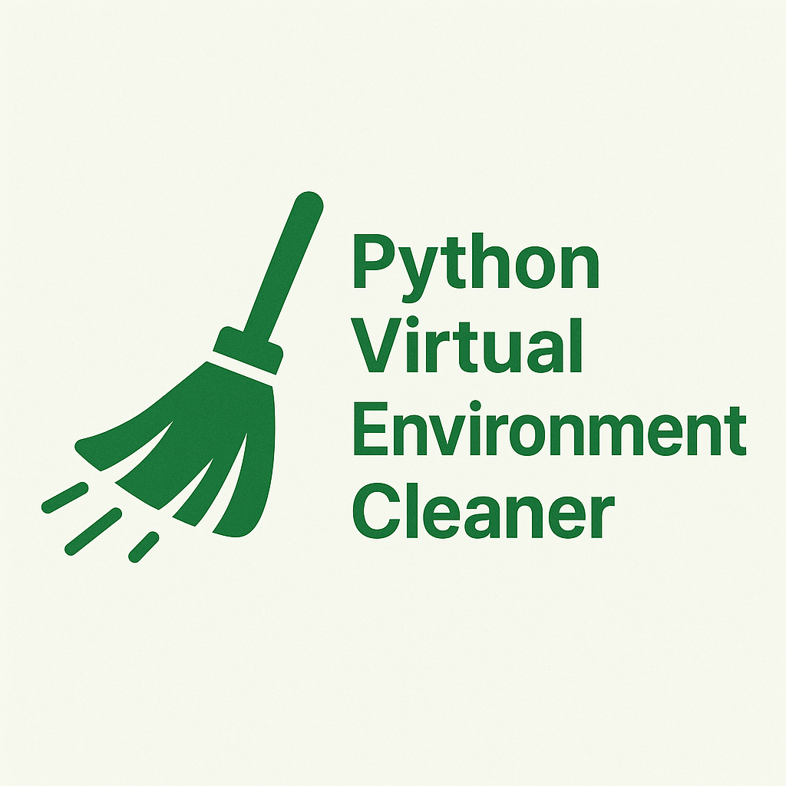

<!-- @format -->

# Python Virtual Environment Cleaner

<p align="center">
  
</p>

## Overview

This script searches for old virtual environments and deletes them.

## Features

- Search for old virtual environments in a given directory.
- Delete old virtual environments.
- Dry run mode.

### Deletion Criteria

A directory is considered for deletion when:

1. It is identified as a virtual environment if:

   - It contains a `pyvenv.cfg` file, or
   - It contains `bin/activate` (Unix-like systems), or
   - It contains `Scripts/activate.bat` (Windows systems)

2. OR it is a cache directory:

   - `.mypy_cache`
   - `.ruff_cache`
   - `.pytest_cache`

3. AND it has Python package management files in its parent directory:

   - `pyproject.toml`
   - `poetry.lock`
   - `uv.lock`
   - `requirements.txt`
   - `setup.py`
   - `setup.cfg`
   - `requirements-dev.txt`
   - `Pipfile`
   - `Pipfile.lock`
   - `environment.yml`
   - `conda-env.yml`
   - Or if it's inside a `.tox` directory

4. AND the owning project's source code has not been modified for more than the specified number of days (default: 180 days).

   "Source code" age is determined by the latest mtime of files under the project directory, excluding venv/cache directories themselves and other tool-managed paths (`.git`, `.tox`, `__pycache__`, `node_modules`). This way, regenerating caches or re-running `uv sync` does not falsely refresh the project's age.

## Requirements

- Python 3.12 or higher
- [uv](https://docs.astral.sh/uv/) - Python package manager

## Installation

Install dependencies:

```bash
uv sync
```

## Usage

### Basic Usage

Dry run (preview what will be deleted):

```bash
uv run main.py --directory <path> --days <days>
```

Execute deletions:

```bash
uv run main.py --directory <path> --days <days> --execute
```

### Options

- `--directory`: Path to the directory to search for virtual environments (required)
- `--days`: Days threshold to remove old venvs (default: 180)
- `--execute`: Actually delete the virtual environments (without this flag, it's a dry run)

## Examples

### Dry run

Example:

```bash
uv run main.py --directory ../dev --days 100
```

Log Example:

```text
INFO | Searching for virtual environments older than 100 days in '../dev'...
INFO | Searching for virtual environments older than 2026-02-16
INFO | Dry run: yes

INFO | 🔎 Found old directory: ../dev/hoge-project/app/.venv
INFO |    📅 Last modified: 2025-12-09
INFO |    💾 Size: 1.00 GB
INFO |    🚫 Dry run: not deleted

INFO | 🔎 Found old directory: ../dev/hoge-project/app/.mypy_cache
INFO |    📅 Last modified: 2025-12-09
INFO |    💾 Size: 356.78 MB
INFO |    🚫 Dry run: not deleted

...

INFO |
Result summary:
INFO | - Detected old virtual environments: 63
INFO | - Freed total capacity: 13.15 GB

INFO | To actually delete, add the --execute flag
```

### Execute deletion

```bash
uv run main.py --directory ../dev --days 100 --execute
```

## Development

### Code Quality

Lint code with Ruff:

```bash
uv run ruff check .
```

Auto-fix linting issues:

```bash
uv run ruff check --fix .
```

Format code with Black:

```bash
uv run black .
```

Type check with mypy:

```bash
uv run mypy .
```

Run all checks with tox:

```bash
uv run tox
```

### Project Structure

```
.
├── main.py         # Core logic and CLI entry point
├── constants.py    # Configuration constants (cache dirs, package files)
└── pyproject.toml  # Project configuration and dependencies
```

### Code Standards

- Python 3.12+
- Type hints required for all functions
- Google-style docstrings
- Line length: 79 characters
- Use `pathlib.Path` for file operations
